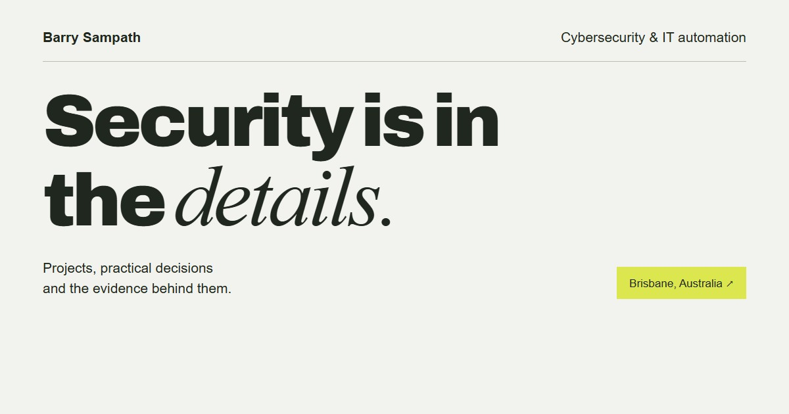

# Barry Sampath | Field Notes

[View the live portfolio](https://bharath-blazecode.github.io/)

[](https://bharath-blazecode.github.io/)

This repository contains the source for my portfolio, a static site built with HTML, CSS and JavaScript.

The website carries the professional story and project detail. This README is for people who want to inspect, run or maintain the code.

## Visit the work

- [ITDR Home Lab](https://bharath-blazecode.github.io/work/homelab/)
- [ClassQuest](https://bharath-blazecode.github.io/work/classquest/)
- [LUNA](https://bharath-blazecode.github.io/work/luna/)

Each case study separates project context, my contribution and the evidence available for inspection.

## Run locally

Node.js 22 or later is required. The source preview, static checks and build use Node's built-in modules, so they do not require an npm install.

| Command | Purpose |
|---|---|
| `npm start` | Serve the source at `http://127.0.0.1:48763` |
| `npm test` | Check routes, links, metadata, assets and factual safeguards |
| `npm run build` | Verify the site and copy public files into `dist/` |
| `npm run preview` | Serve the completed `dist/` build |

Run `npm run build` before `npm run preview`. Stop either server with Ctrl+C.

The browser test requires the development dependencies and Chromium:

```sh
npm ci --ignore-scripts
npx playwright install chromium
npm run test:browser
```

The browser suite exercises the homepage, three case studies and 404 page at desktop and 320px widths. It also checks both themes, reduced-motion behavior, keyboard interaction, the scripted sequences, the terminal and the no-JavaScript path. Axe is included for automated accessibility checks, but an automated pass does not establish WCAG conformance or replace assistive-technology testing.

## Repository map

```text
index.html                  homepage
404.html                    missing-page response
work/homelab/index.html     ITDR Home Lab case study
work/classquest/index.html  ClassQuest case study
work/luna/index.html        LUNA case study
css/site.css                responsive, theme and print styles
js/theme.js                 early theme restoration
js/site.js                  motion, navigation and terminal enhancements
assets/                     project media, fonts and social preview
resume/                     June 2026 resume, marked as needing an update
tools/                      verification, build and preview scripts
tests/browser.cjs           Playwright browser checks
```

The HTML files are the editable source of truth. Shared navigation is repeated across the five pages, so a global navigation change must be applied to each one. `npm test` catches broken local links and fragments.

## Design and accessibility behavior

The primary content and navigation use ordinary HTML. JavaScript progressively adds the theme control, decorative sequences and terminal interaction.

Day and night themes follow the operating-system preference until the visitor makes a local choice. Most decorative sequences settle within five seconds. On wider screens, the telemetry flow repeats while visible, and the diagram itself can pause or resume it. All motion stops when the page is hidden; an interrupted sequence restarts if it is still in view. With `prefers-reduced-motion`, the page presents the complete static content instead. The homelab diagrams remain understandable without animation.

The terminal is a fixed-response text interface. It does not execute commands, scan systems, contact a backend or submit visitor data. User input is inserted as text rather than HTML.

Images have alternative text and explicit dimensions. Fonts are self-hosted, and the deployed site has no runtime dependencies, analytics script or remote font request.

## Content boundaries

Repository changes should preserve the distinction between completed work, shared work, teaching examples and future plans.

- ITDR Home Lab Phase 1 established endpoint telemetry collection. The lab is paused, and detection-rule development remains future work.
- The animated telemetry path and sample trace are explanatory visuals. They are not live telemetry, a recorded incident or evidence of response time.
- ClassQuest was built by a five-person team, and the People's Choice Award belongs to the team. My individual contribution is supported by the ten linked pull requests.
- LUNA is shared work with Zhirui Lu. Individual, shared and vendor contributions should remain attributed.
- DissentKit is presented as an early experiment without a claim of independently established effectiveness.
- The included resume is from June 2026 and is explicitly marked as needing an update. It should not be presented as the current source of truth.

## Build and deployment

GitHub Pages serves the site from the repository-root routes. The optional build validates the source and creates an allowlisted static copy in `dist/`. The `dist/` directory is ignored and is not the current hosting source.

Font licence files are included in `assets/fonts/`. The repository has no top-level licence, so no blanket reuse permission should be inferred for project screenshots, photographs, diagrams or responder artwork.
